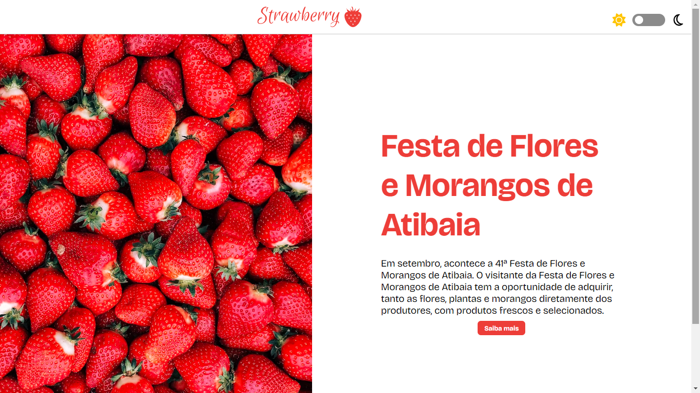

<h1 align="center"> Strawberry </h1>

<p align="center">
  Landing page temática para o evento "Festa de Flores e Morangos de Atibaia".<br/>
</p>

<p align="center">
  <a href="#-tecnologias">Tecnologias</a>&nbsp;&nbsp;&nbsp;|&nbsp;&nbsp;&nbsp;
    <a href="#-instalacao-do-projeto">Instalação do projeto</a>&nbsp;&nbsp;&nbsp;|&nbsp;&nbsp;&nbsp;
  <a href="#-sobre-o-projeto">Sobre o Projeto</a>&nbsp;&nbsp;&nbsp;
</p>

<p align="center">
  
</p>

<p align="center">
  <a href="https://vs-12-front-strawberries.vercel.app/" target="_blank">➡️ Acesse o deploy!</a>
</p>

## 🚀 Tecnologias

Esse projeto foi desenvolvido com as seguintes tecnologias:

- React
- Typescript
- Styled Components
- Vitest

## ⚙️ Instalação do projeto

Passo-a-passo:

1. Comandos necessários para executar:

```
yarn i
yarn dev
```

> Particularidades do projeto. Dependência externa.

## 💻 Sobre o Projeto

Este projeto foi proposto pelo Vem Ser para aplicar os conceitos de React Context e Styled Components.
